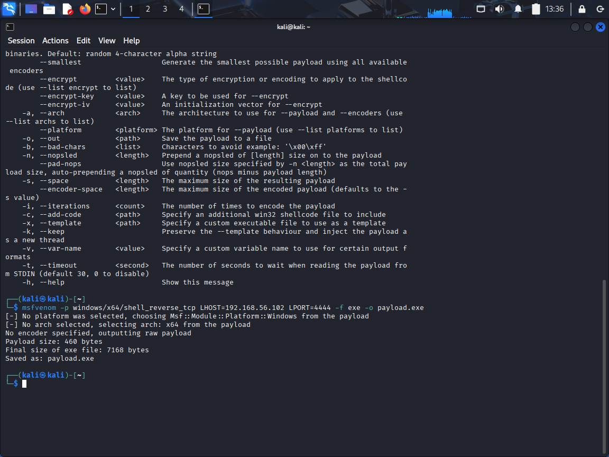
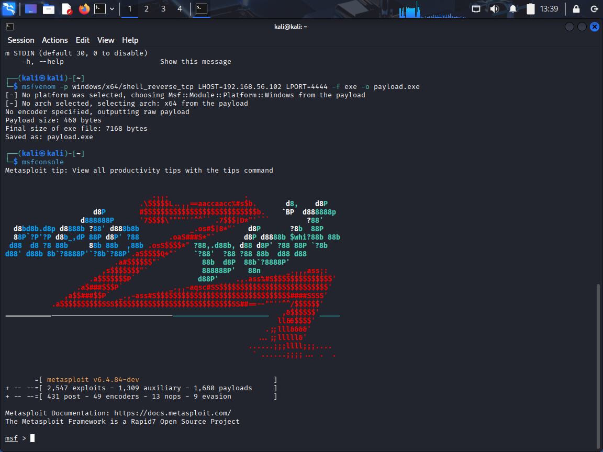
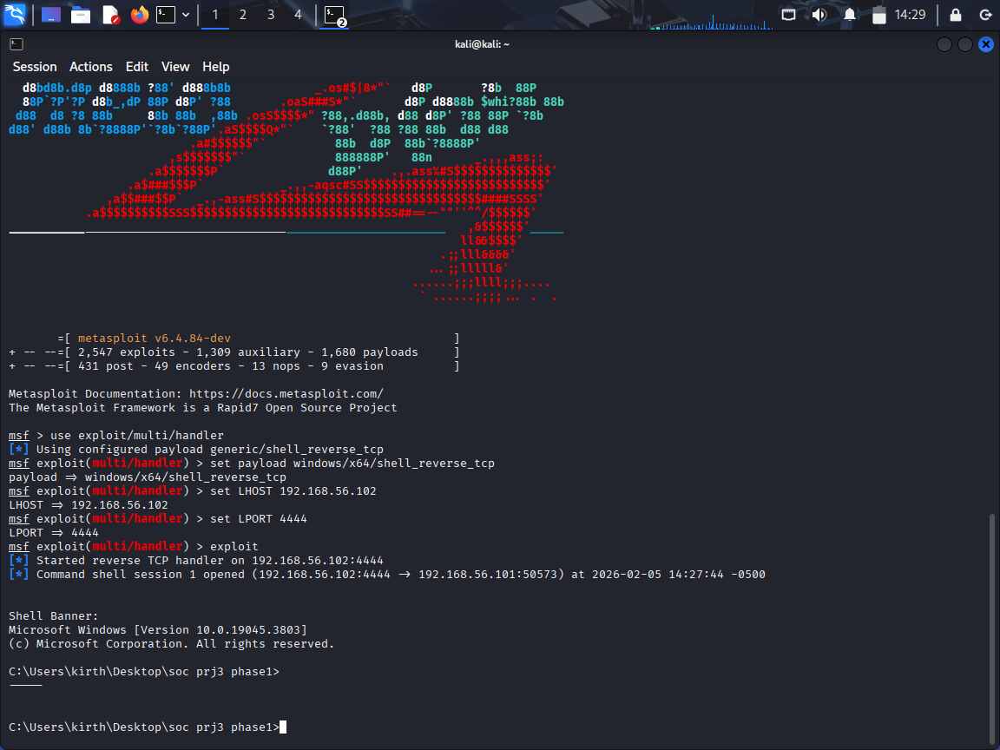
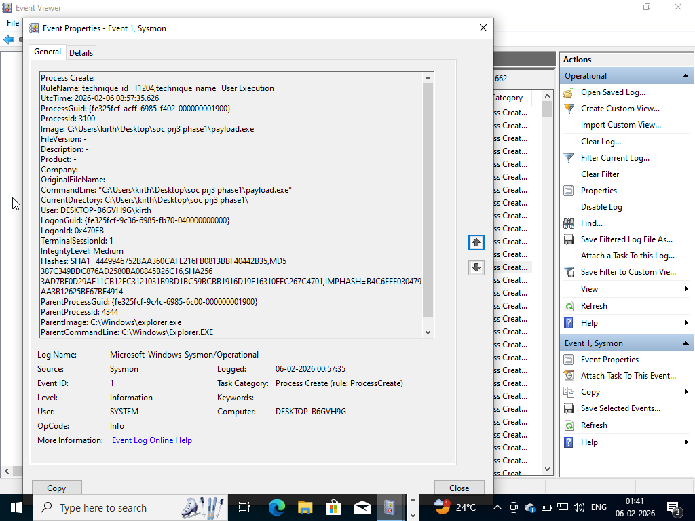
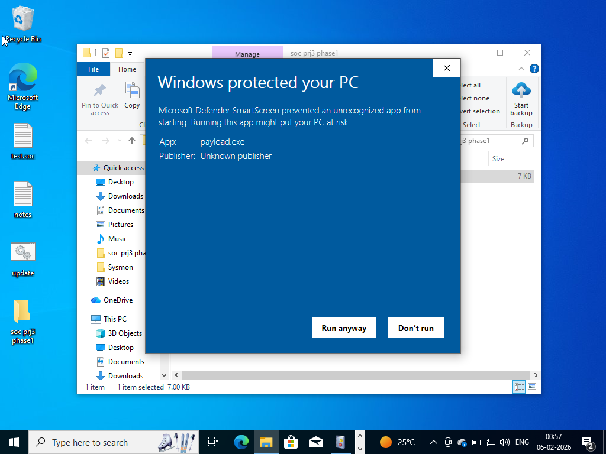
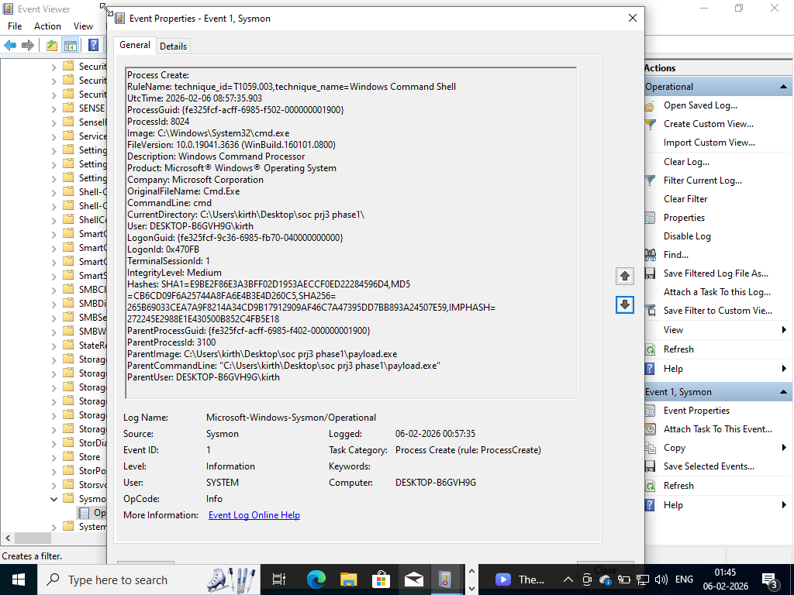
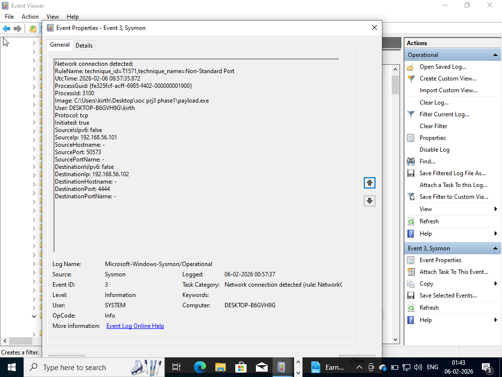
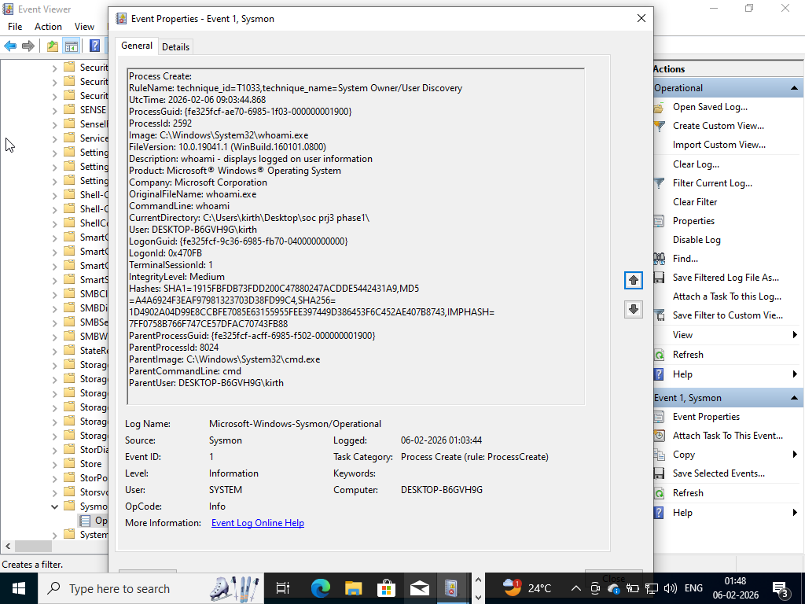
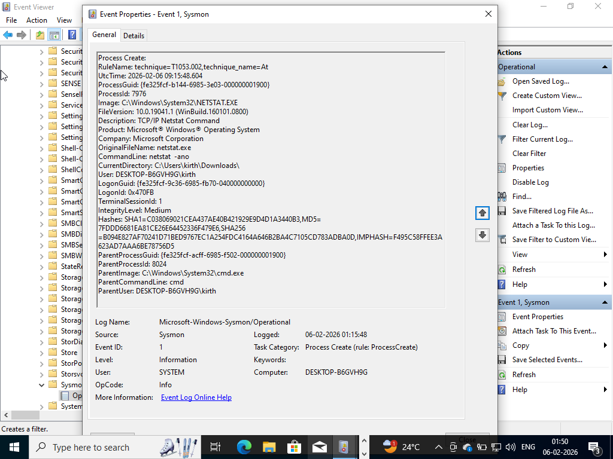

# Phase 1 – Safe Attack Simulation & SOC Investigation

## Objective
The objective of this phase was to safely simulate an attacker compromising a system in a controlled lab environment and investigate the resulting activity as a Security Operations Center (SOC) analyst.

This phase focuses on understanding how attacker behavior appears in system logs and how defenders can detect and investigate such activity.

---

# Lab Environment Setup

The investigation was performed in an isolated virtual lab environment.

## Machines Used

- **Victim Machine:** Windows 10 Virtual Machine
- **Attacker Machine:** Kali Linux Virtual Machine

## Monitoring Tools

- Sysmon for endpoint telemetry collection
- Windows Event Viewer for log analysis
- Windows Defender for baseline protection monitoring
- Wireshark (optional) for network observation

## Network Configuration

Both machines were placed in an isolated virtual network to safely simulate attacker activity without affecting external systems.

---

# Attack Simulation Overview

A controlled and harmless attack simulation was performed to emulate attacker behavior.

## Simulation Steps

1. A test payload was generated on the attacker machine.
2. A listener was started on the attacker machine.
3. The payload was executed on the victim machine.
4. A reverse shell session was established between victim and attacker.

This simulation allowed observation of attacker actions without using real malware.

---

# Attack Simulation Evidence

The following screenshots document the simulated attack process and the resulting system activity.

---

## 1. Payload Creation

A payload was generated on the attacker machine to simulate malicious code execution on the victim system.

---

## 2. Listener Started

A listener was started on the attacker machine to wait for incoming connections from the victim system.

---

## 3. Session Establishment

After payload execution, a session was established between the victim machine and the attacker machine.

---

## 4. Payload Execution on Windows

The payload was executed on the victim Windows machine to initiate the simulated compromise.

---

## 5. Security Warning Bypass

Windows security prompts appeared during execution and were bypassed to allow the payload to run.

---

## 6. Reverse Shell Active

A reverse shell session was successfully established, allowing the attacker to execute commands on the victim machine.

---

## 7. Sysmon Network Connection

Sysmon logs captured the network connection generated by the reverse shell between victim and attacker.

This demonstrates how network telemetry can reveal suspicious communication.

---

## 8. Command Execution Verification

The attacker verified system access by executing the `whoami` command through the remote session.

---

## 9. Network Connection Verification

Network connections were validated using `netstat` to confirm active communication between systems.

---

# Telemetry and Logs Observed

After payload execution, multiple system events were generated and captured.

Key observations included:

- Process creation events triggered by payload execution
- Network connection events showing communication between victim and attacker
- Parent-child process relationships indicating suspicious activity

Relevant Sysmon events analyzed:

- **Event ID 1 — Process Creation**
- **Event ID 3 — Network Connection**

These logs help analysts detect and investigate suspicious behavior.

---

# SOC Investigation Process

The investigation followed a SOC analyst workflow:

1. Suspicious process execution identified in logs
2. Process details and command-line arguments reviewed
3. Network connections analyzed to identify attacker communication
4. Timeline of attacker activity constructed
5. Indicators of compromise documented

This process simulates real SOC alert investigation procedures.

---

# Findings

Investigation revealed:

- Execution of a suspicious payload on the victim system
- Outbound connection established to attacker system
- Remote interaction with victim machine observed
- Attack simulation successfully replicated early-stage compromise behavior

---

# Analyst Observations (Unique Findings)

During the safe attack simulation, several behaviors helped illustrate how attacker activity appears in endpoint telemetry:

- Payload execution generated immediate process creation events
- Network connections between victim and attacker were visible in logs
- Parent-child process relationships highlighted suspicious execution chains
- Correlating process execution and network activity enabled timeline reconstruction
- Even controlled simulations generate telemetry similar to early-stage compromises seen in real investigations

## Analyst Insight

This simulation demonstrated how early attacker activity becomes visible through process and network telemetry.

Understanding these patterns helps SOC analysts quickly identify suspicious behavior and begin investigations before full compromise occurs.

---

# Lessons Learned

Key learning outcomes from this phase:

- Importance of process creation monitoring
- Network telemetry plays a critical role in detection
- Timeline reconstruction helps understand attacker movement
- Proper logging is essential for effective incident response

---

# Conclusion

This phase successfully demonstrated how attacker behavior can be simulated and investigated in a controlled environment.

The exercise strengthened understanding of endpoint telemetry analysis and SOC investigation methodology, forming a strong foundation for analyzing real malware scenarios in the next phase.
