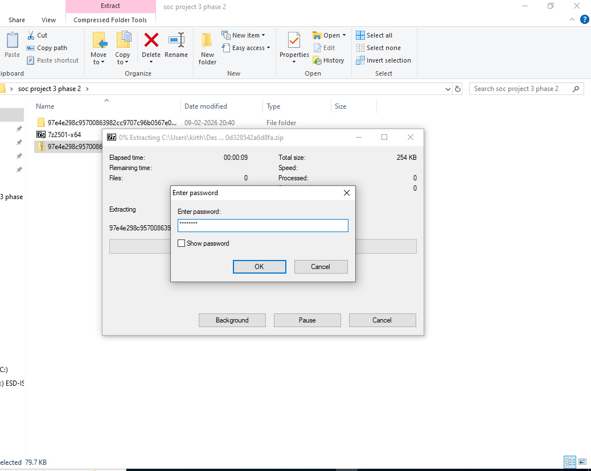
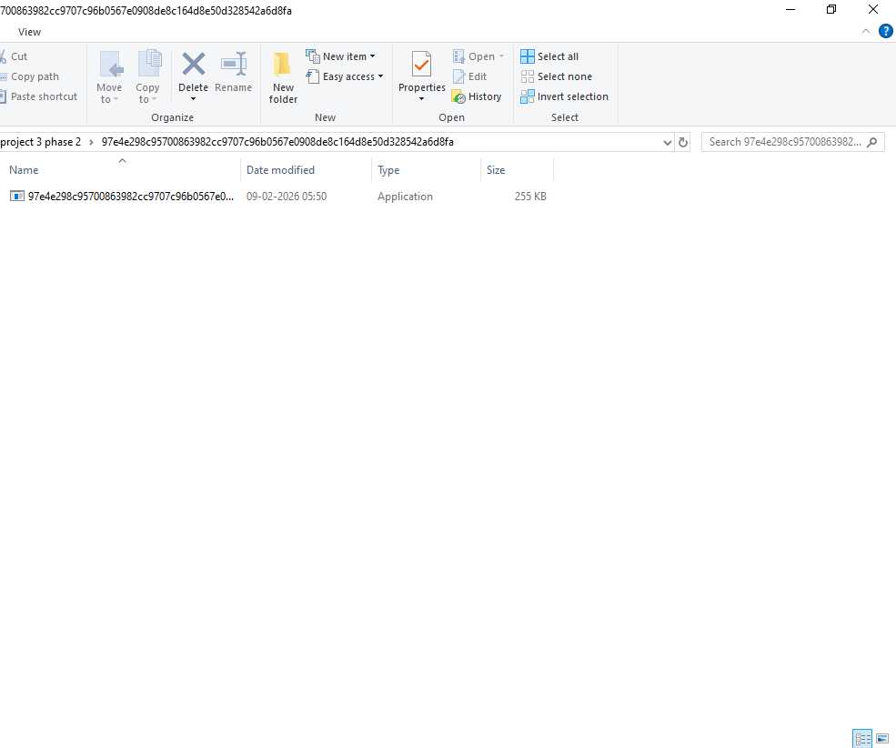
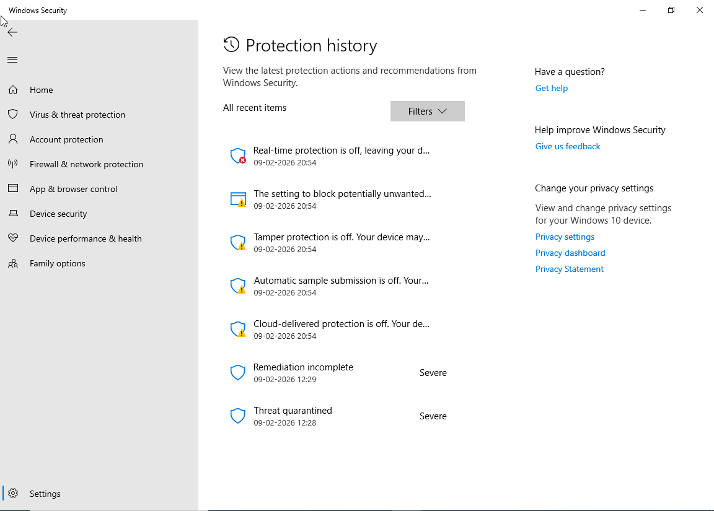
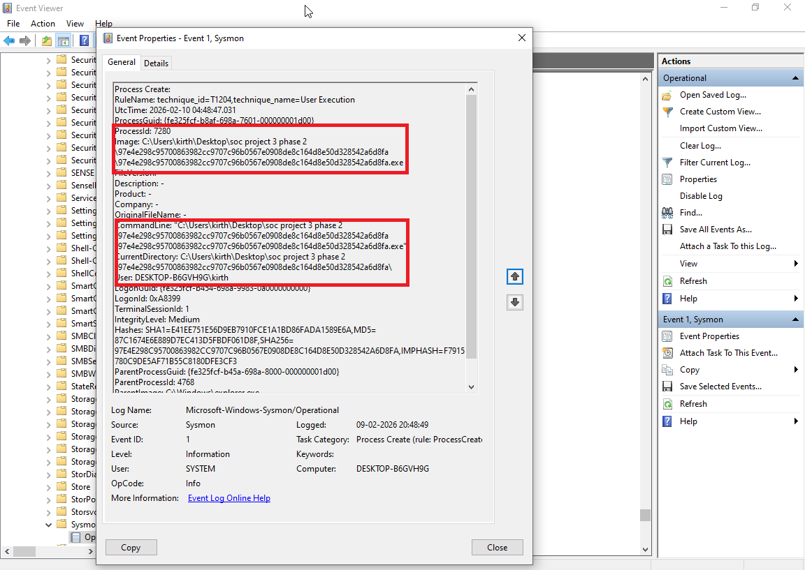
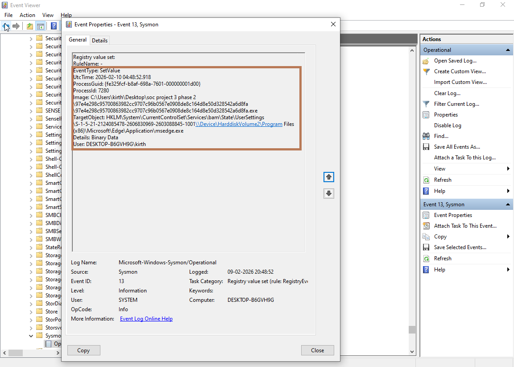
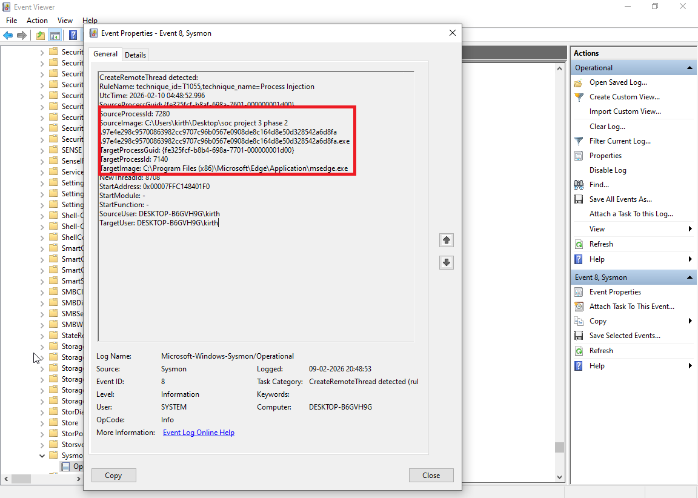
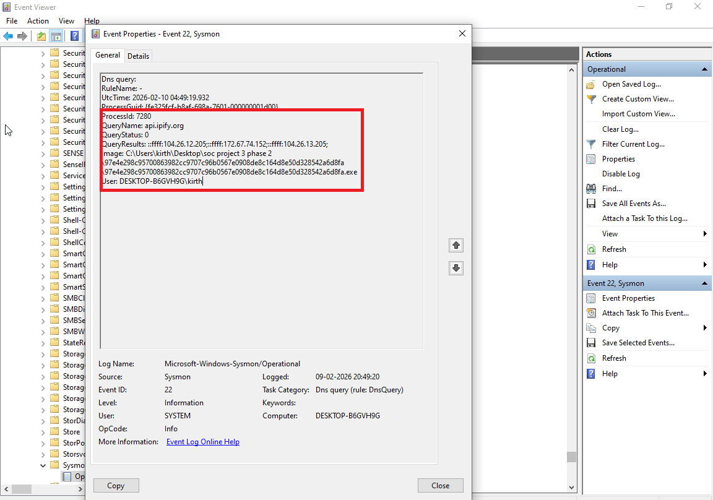
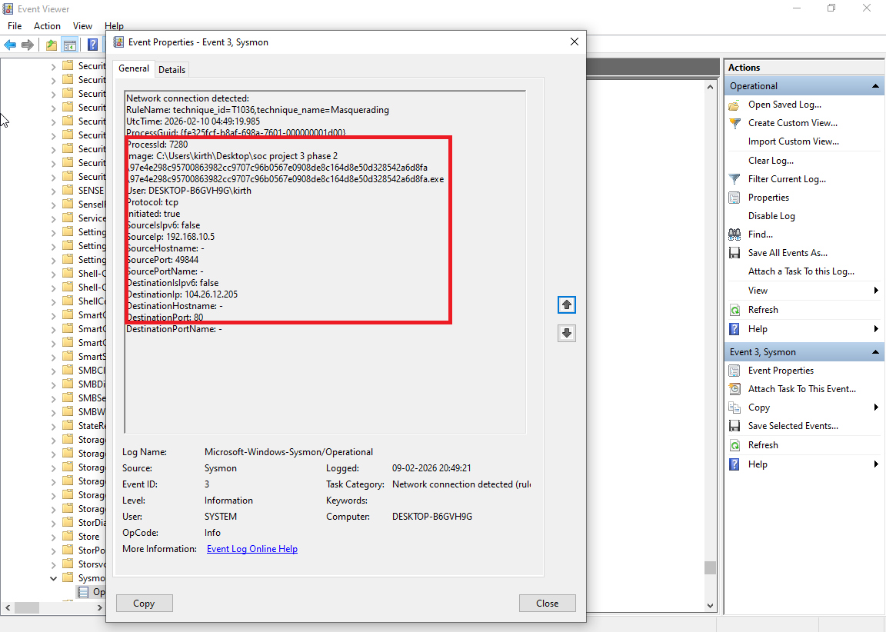
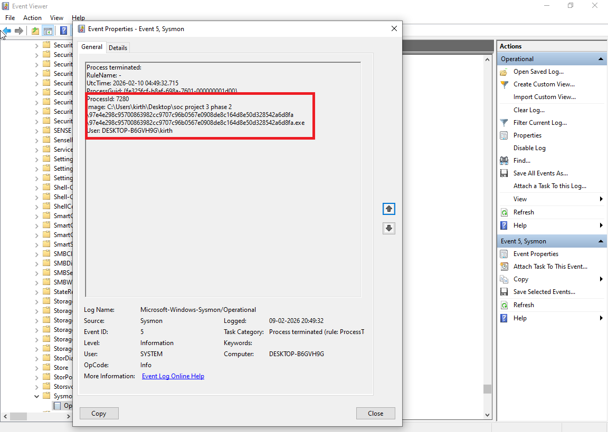
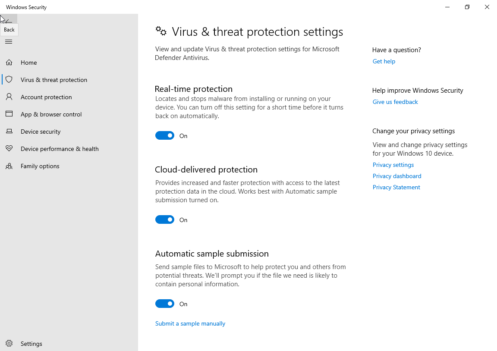

# SOC Investigation Project – Phase 2  
## Malware Execution & Endpoint Investigation

---

# Project Overview

This project simulates execution of a suspicious executable in an isolated lab environment and demonstrates how a Security Operations Center (SOC) analyst detects, investigates, and contains malicious endpoint activity using telemetry logs.

The investigation replicates real SOC incident workflow including execution detection, behavioral analysis, network monitoring, and containment actions.

The goal is to demonstrate practical SOC investigation capabilities using structured analysis and professional incident documentation.

---

# Lab Environment

| Component | Description |
|------------|------------|
| Operating System | Windows Virtual Machine |
| Monitoring Tool | Sysmon |
| Log Analysis | Windows Event Viewer |
| Endpoint Protection | Windows Defender |
| Monitoring Utilities | Task Manager, Command Prompt |
| Environment Type | Isolated Virtual Lab |
| Sample Type | Controlled malware simulation sample |

All activity occurred within an isolated environment to avoid external impact.

---

# Attack Scenario

A suspicious executable was extracted and executed in a controlled environment to simulate endpoint compromise.

Endpoint telemetry revealed process execution, registry changes, process injection, DNS activity, and outbound network communication consistent with malware behavior.

The malicious process was then contained and endpoint protections restored.

---

# Evidence – Malware Extraction

The suspicious archive was extracted to obtain the executable used for the simulation.

---

# Evidence – Malware Sample

The extracted executable was verified before execution.

---

# Evidence – Defender Disabled

Windows Defender was temporarily disabled in the lab to allow controlled execution of the sample.

---

# Evidence – Malware Execution Detected

Sysmon Event ID 1 confirmed execution of the suspicious executable.

---

# Evidence – Registry Modification

Sysmon Event ID 13 detected registry value modification performed by the malware.

---

# Evidence – Process Injection

Sysmon Event ID 8 recorded process injection into a legitimate process.

---

# Evidence – DNS Query Activity

Sysmon Event ID 22 detected DNS queries performed by the malware.

---

# Evidence – Network Communication

Sysmon Event ID 3 captured outbound network connections from the infected process.

---

# Evidence – Containment Action

The malicious process was manually terminated to stop further activity.

---

# Evidence – Defender Restored

Windows Defender protection was re-enabled after containment.

---

# Incident Investigation Timeline

| Stage | Description |
|--------|------------|
| Malware Acquisition | Suspicious archive extracted |
| Protection Disabled | Defender temporarily disabled |
| Malware Execution | Suspicious executable launched |
| Registry Modification | Registry values modified |
| Process Injection | Code injected into legitimate process |
| DNS Activity | External domain lookups |
| Network Communication | Outbound connections detected |
| Containment | Malicious process terminated |
| Recovery | Endpoint protection restored |

---

# Attack Flow Overview
