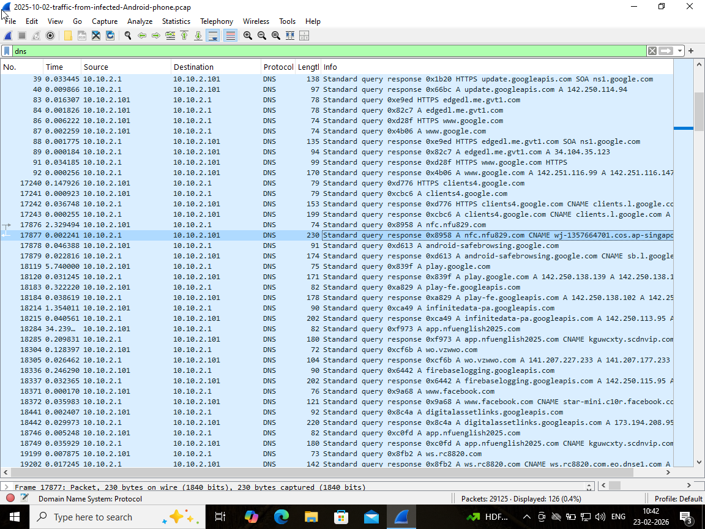
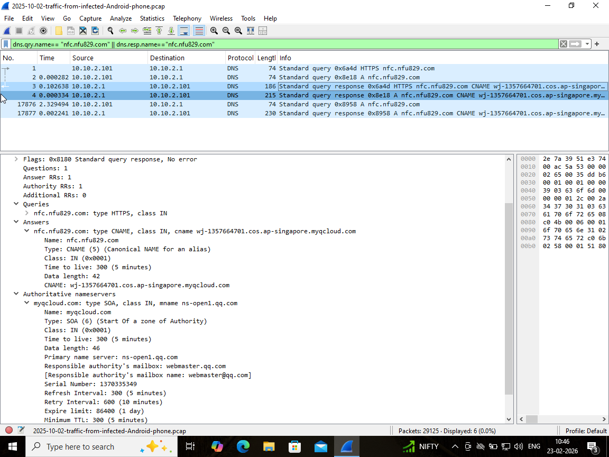
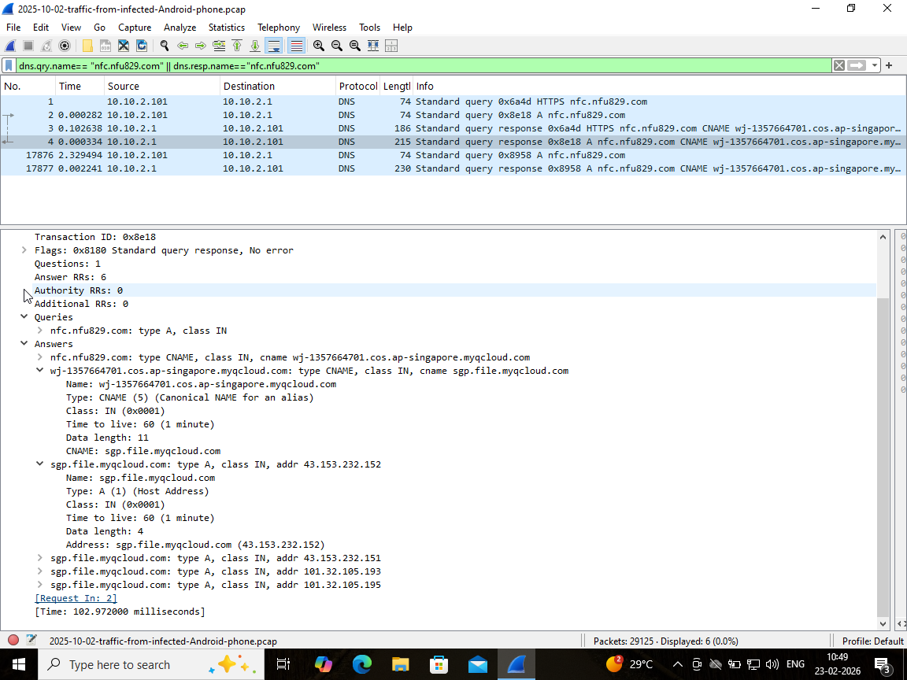
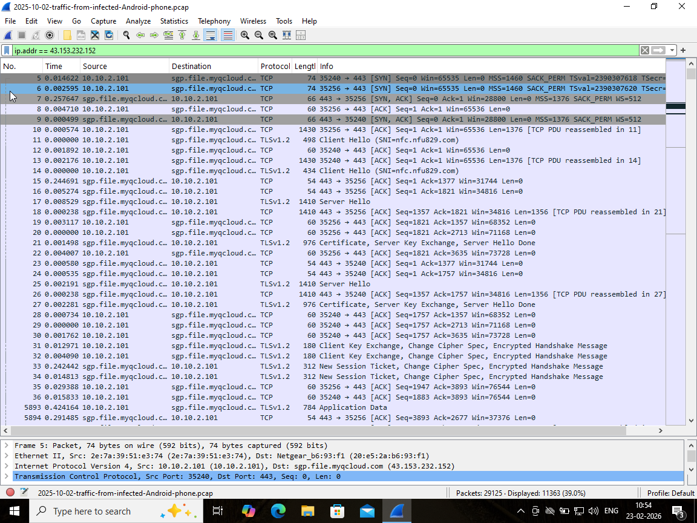
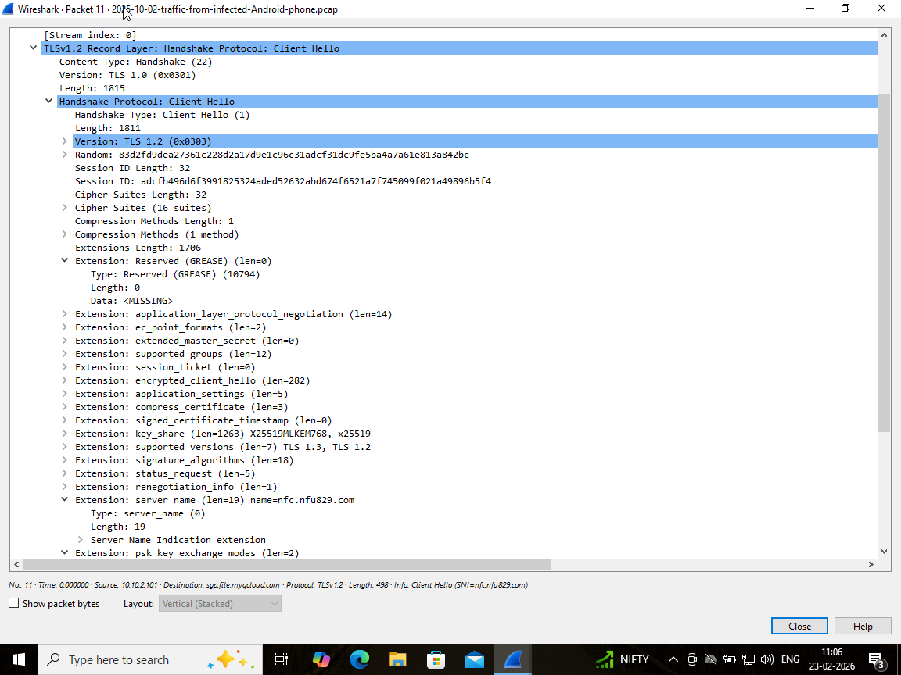
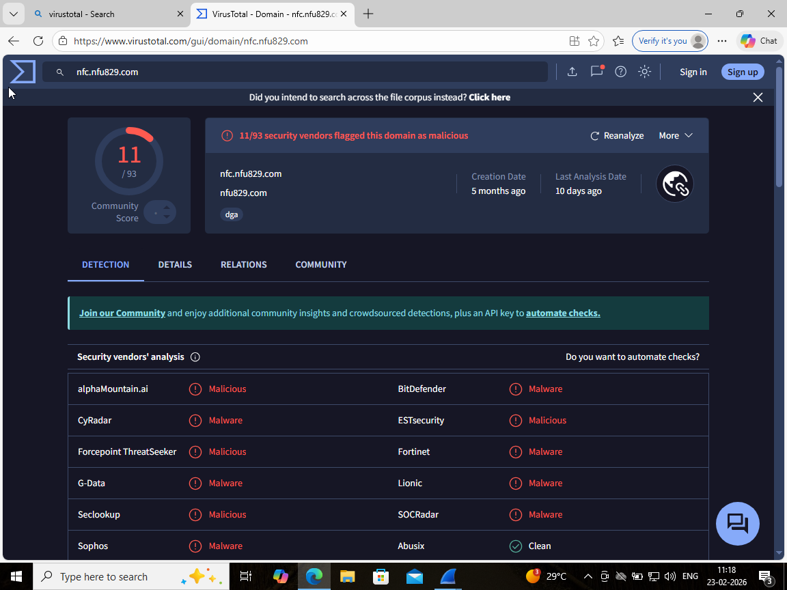

# 🛡️ Project 4 – PCAP Traffic Analysis (Malware Investigation)

---

## 📌 Objective

The objective of this project is to analyze a network packet capture (PCAP) file from a potentially infected system, identify suspicious communication, extract Indicators of Compromise (IoCs), and determine attacker behavior using network traffic analysis.

---

## 🧪 Environment & Tools

* **Tool Used:** Wireshark
* **Dataset:** Malware Traffic Analysis (Public Dataset)
* **Analysis Type:** Static PCAP analysis
* **Focus:** DNS, TCP, TLS, Threat Intelligence

---

## 🔍 Investigation Methodology

The investigation followed a structured SOC workflow:

1. Traffic triage (protocol-based filtering)
2. Identification of anomalous domains
3. DNS resolution tracking (CNAME + IP mapping)
4. IP-based communication analysis
5. TLS inspection (encrypted traffic analysis)
6. Traffic behavior analysis
7. Threat intelligence correlation
8. Evidence-based conclusion

---

# 📡 Step 1 – Initial Traffic Analysis

Applied Wireshark filter:

```
dns
```

### Observations

* Internal host `10.10.2.101` actively querying DNS
* Majority of domains appear legitimate (Google, Firebase, etc.)

### Key Finding

A suspicious domain was identified:

```
nfc.nfu829.com
```

### Evidence



---

# 🌐 Step 2 – Suspicious Domain Identification

Applied Wireshark filter:

```
dns.qry.name == "nfc.nfu829.com" || dns.resp.name == "nfc.nfu829.com"
```

### Observations

* Repeated DNS queries for the same domain
* Persistent resolution attempts

### Suspicion Indicators

* Unusual/random naming structure  
* Not associated with known services  
* Repeated query behavior  

### Evidence



---

# 🔗 Step 3 – DNS Resolution Chain Analysis

### Resolution Chain

```
nfc.nfu829.com
 → wj-1357664701.cos.ap-singapore.myqcloud.com
 → sgp.file.myqcloud.com
```

### Extracted IP Addresses

* 43.153.232.152
* 43.153.232.151
* 101.32.105.193
* 101.32.105.195

### Key Insight

* Use of **cloud infrastructure (myqcloud)**  
* Common technique attackers use to hide servers  
* Multiple IPs indicate distributed hosting  

### Evidence



---

# 🌍 Step 4 – IP Communication Analysis

Applied Wireshark filter:

```
ip.addr == 43.153.232.152
```

### Observations

Communication observed between:

* `10.10.2.101` (internal host)
* `43.153.232.152` (external server)

Protocol observed:

* TCP over port **443 (HTTPS)**

### Key Insight

Encrypted communication channel suggests potential **command-and-control traffic**.

### Evidence



---

# 🔐 Step 5 – TLS Handshake Analysis

### Findings

TLS Client Hello packet observed.

### Extracted

Server Name Indication (SNI):

```
nfc.nfu829.com
```

### Key Insight

Even with encrypted traffic, **TLS SNI reveals the destination domain**, enabling detection of suspicious connections.

### Evidence



---

# 📊 Step 6 – Traffic Behavior Analysis

Using **Wireshark Conversations Statistics**

### Observations

* Repeated communication with specific external IP
* Continuous data exchange

### Key Insight

Persistent traffic patterns suggest **beaconing behavior typical of malware communication**.

### Evidence


---

# 🧪 Step 7 – Threat Intelligence Correlation

Tool used:

* **VirusTotal**

### Result

* Domain flagged by **11/93 vendors**

### Important Observation

Some engines reported the domain as clean.

### Analyst Insight

Low detection rate may indicate:

* Newly created malware infrastructure  
* Recently registered domain  
* Low reputation domain  

### Evidence



---

# 🧠 Attack Narrative (What Happened)

The internal host (`10.10.2.101`) initiated DNS queries to a suspicious domain (`nfc.nfu829.com`).

The domain resolved through multiple cloud-based layers (myqcloud infrastructure), eventually mapping to external IP addresses.

Following resolution, the host established encrypted HTTPS communication with one of the resolved IPs (`43.153.232.152`).

TLS analysis confirmed that encrypted traffic targeted the suspicious domain via SNI.

Repeated DNS queries and continuous encrypted communication indicate that the system likely maintained a persistent connection with attacker infrastructure.

👉 This behavior aligns with **command-and-control (C2) communication**.

---

# 🚩 Why This Activity is Suspicious

* Random domain naming pattern  
* Cloud-hosted infrastructure  
* Multiple DNS resolutions  
* Encrypted HTTPS communication  
* Persistent communication behavior  
* Partial threat-intelligence detection  

---

# 🧩 Indicators of Compromise (IoCs)

### Domains

* nfc.nfu829.com
* wj-1357664701.cos.ap-singapore.myqcloud.com
* sgp.file.myqcloud.com

### IP Addresses

* 43.153.232.152
* 43.153.232.151
* 101.32.105.193
* 101.32.105.195

---

# 🧬 MITRE ATT&CK Mapping

* **T1071.001** – Application Layer Protocol: Web  
* **T1071.004** – DNS  
* **T1573** – Encrypted Channel  
* **T1090** – Proxy / Cloud infrastructure  

---

# 🧠 Unique Analytical Insight

Although the domain (`nfc.nfu829.com`) was not consistently flagged as malicious across all threat-intelligence engines, behavioral indicators strongly suggest suspicious activity.

### Observed Indicators

* Repeated DNS queries  
* Cloud-hosted infrastructure  
* Encrypted outbound communication  
* TLS SNI revealing suspicious domain  
* Persistent traffic patterns  

### Key Insight

**Detection ≠ Verdict**  
**Behavior determines maliciousness**

Network behavior analysis can reveal malicious intent even when detection engines show limited results.

---

# 🛡️ Recommendations

* Block identified domains and IP addresses  
* Monitor DNS queries for similar patterns  
* Inspect TLS SNI fields  
* Deploy network detection rules  
* Correlate alerts with threat intelligence  

---

# 📌 Conclusion

The investigation revealed that the internal system communicated with a suspicious domain hosted on cloud infrastructure.

DNS behavior, encrypted communication, and threat intelligence correlation indicate **possible malware command-and-control (C2) activity**.

This analysis demonstrates the importance of combining **network behavior analysis with threat intelligence**.

---

# 🏁 Skills Demonstrated

* Network Traffic Analysis  
* DNS Investigation  
* TLS Inspection  
* Threat Intelligence Correlation  
* IOC Extraction  
* SOC Investigation Workflow

---
