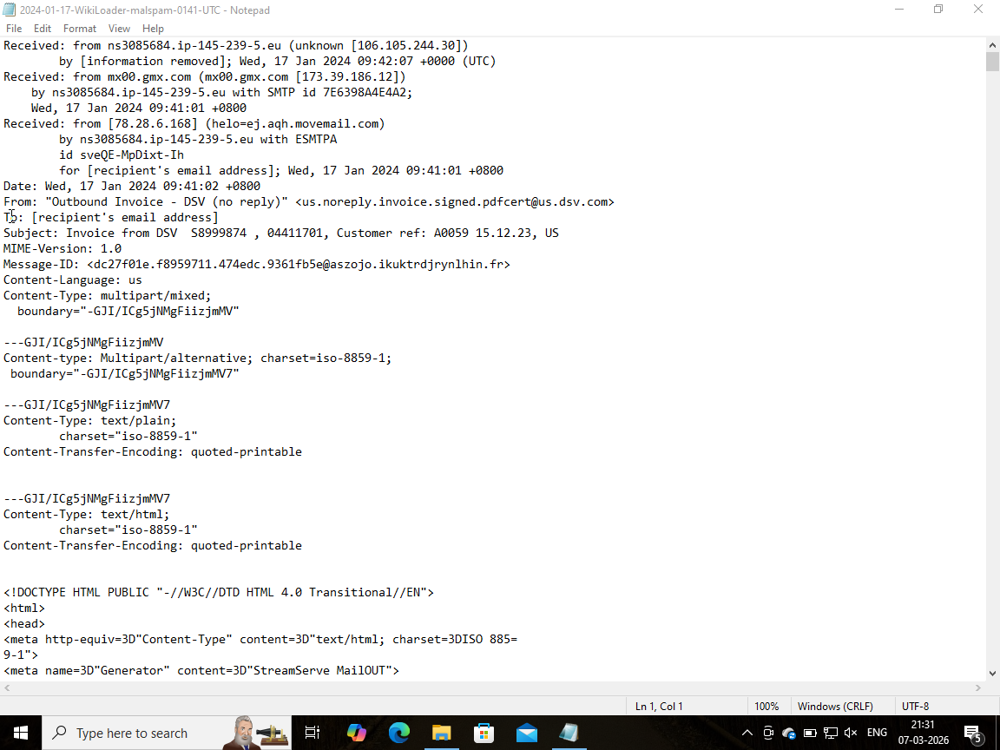
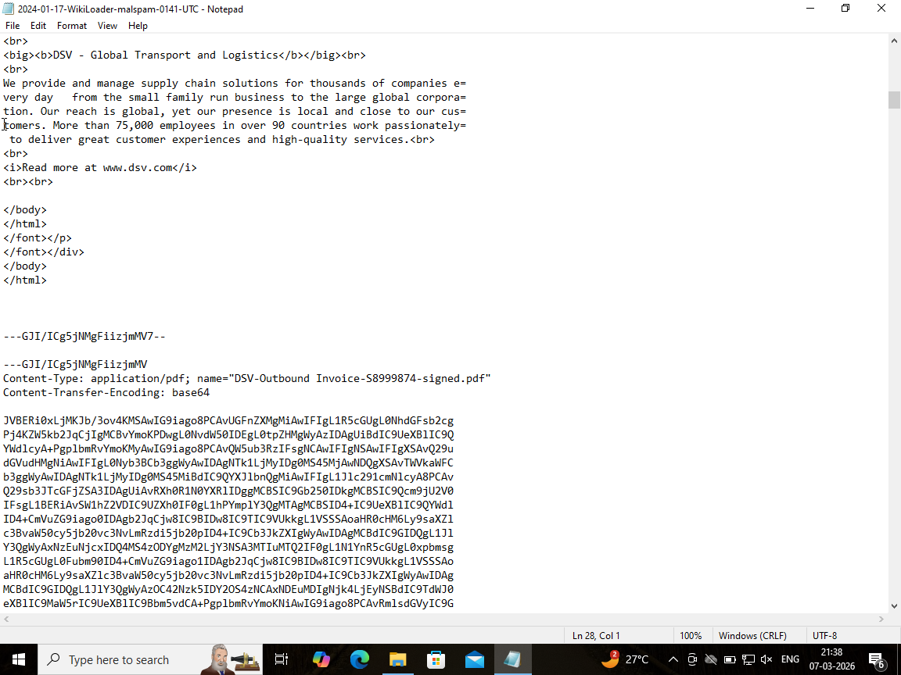
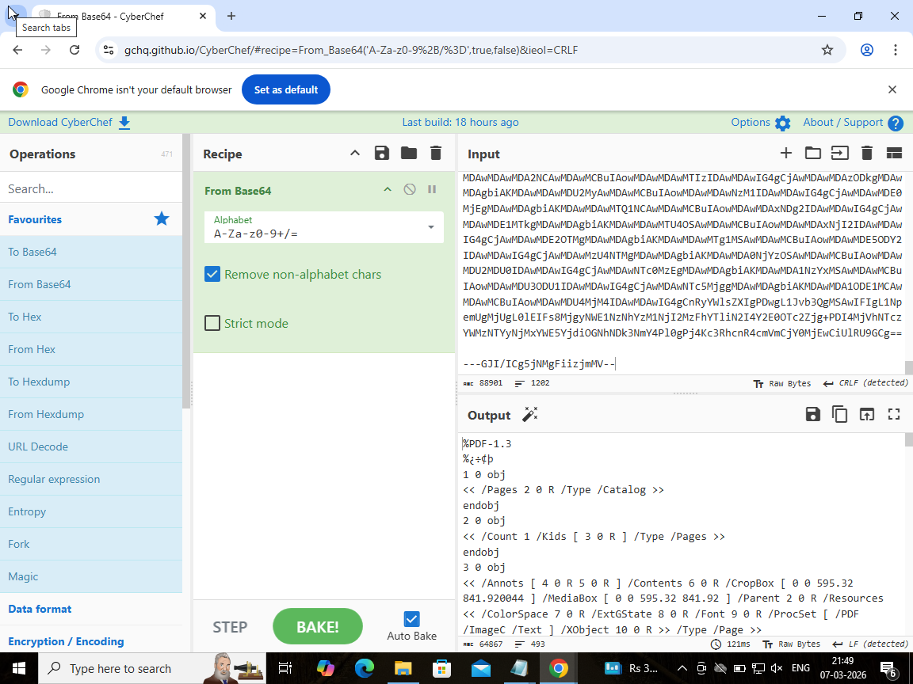
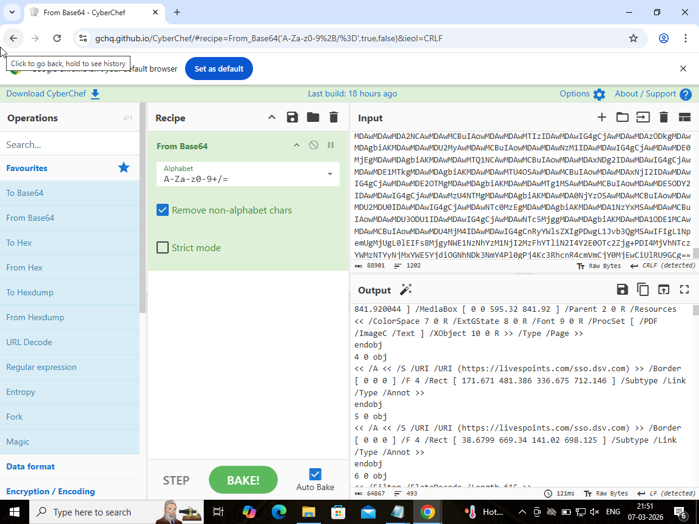
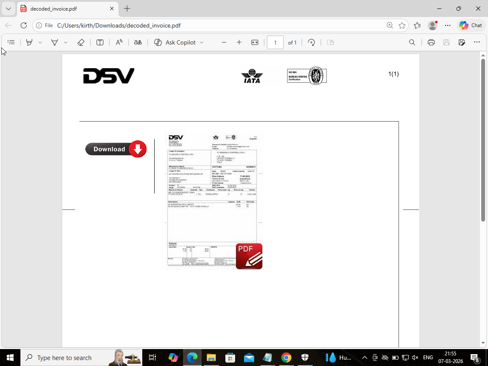
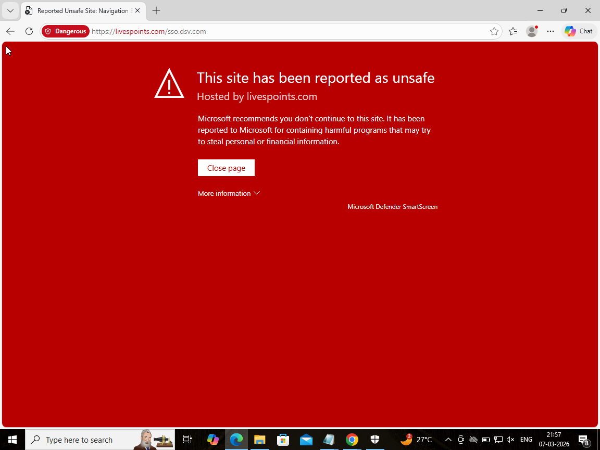
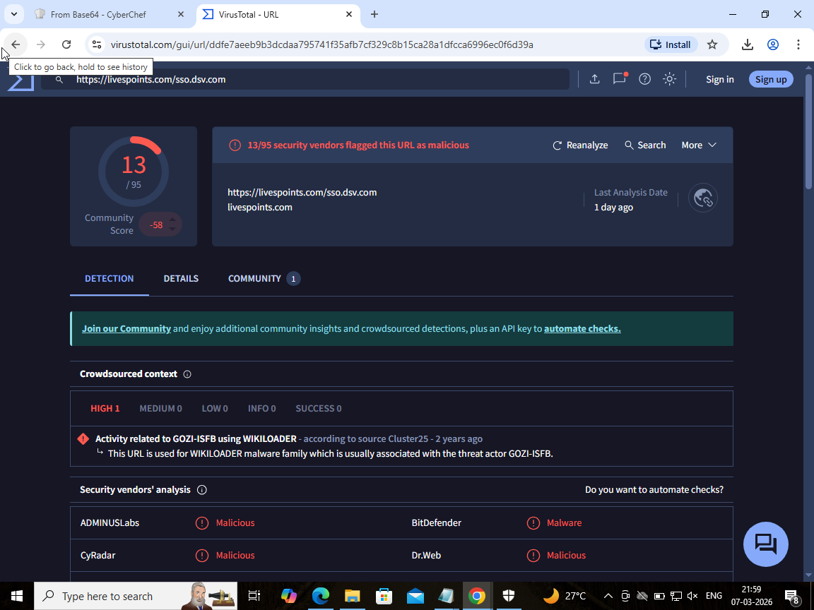
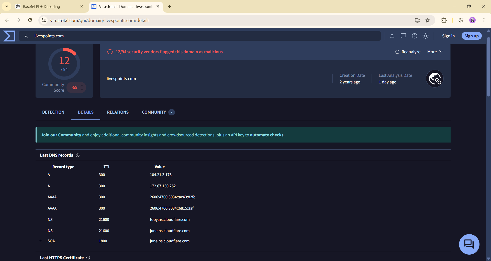
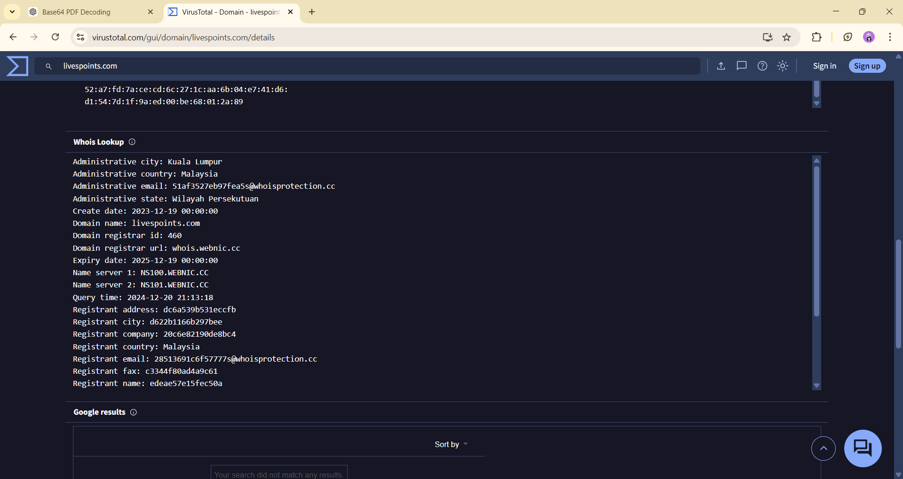

# Project 5 — Phishing Email Investigation (DSV Invoice Campaign)

## Project Overview
This project documents the investigation of a phishing email delivering a malicious PDF attachment impersonating a logistics invoice notification. The attachment contained an embedded hyperlink redirecting victims to a suspicious phishing domain.

The objective of this investigation was to analyze the email structure, decode the attachment, identify malicious content, and reconstruct the attack chain used in the phishing campaign.

---

## Skills Demonstrated

- Email Header Analysis
- MIME Structure Investigation
- Base64 Decoding
- PDF Document Analysis
- Phishing URL Investigation
- Threat Intelligence Analysis
- DNS Infrastructure Investigation
- Attack Chain Reconstruction

 ---

## Investigation Environment

The analysis was performed in a controlled lab environment using the following tools:

- CyberChef
- VirusTotal
- Windows Virtual Machine
- Browser security protections

---

## Email Header Analysis

The phishing email was analyzed in its raw `.eml` format.

Key observations:

- The email impersonates **DSV logistics**
- The email claims to contain an **invoice**
- The message includes a **Base64 encoded PDF attachment**

### Evidence

---

## Attachment Discovery

Inspection of the MIME structure revealed a PDF attachment embedded within the email.

Important indicators identified:

Content-Type: application/pdf  
Content-Transfer-Encoding: base64

This confirms the attachment is encoded directly within the email body.

### Evidence

---

## Base64 Decoding

The encoded attachment was extracted and decoded using **CyberChef**.

After decoding, the file signature revealed:

%PDF-1.3

This confirmed that the attachment is a **PDF document**.

### Evidence

---

## PDF Structural Analysis

Inspection of the decoded PDF structure revealed embedded hyperlinks within the document.

The following object was identified inside the PDF structure:

/URI (https://livespoints.com/sso.dsv.com)

This indicates the PDF contains a **clickable hyperlink redirecting users to an external website**.

### Evidence

---

## Phishing Lure Analysis

Opening the decoded PDF revealed a fake invoice preview impersonating **DSV logistics**.

The document contains a **Download button** designed to trick users into clicking the embedded malicious link.

### Evidence

---

## Malicious URL Investigation

Clicking the embedded link attempts to redirect the user to the following URL:

https://livespoints.com/sso.dsv.com

The browser blocked the page and displayed a security warning indicating the site has been reported as unsafe.

### Evidence

---

## Threat Intelligence Analysis

The extracted URL was analyzed using **VirusTotal**.

Results showed:

13 / 95 security vendors flagged the URL as malicious.

Threat intelligence sources also associated the URL with suspicious activity.

### Evidence

---

## Infrastructure Analysis

Domain analysis revealed that the phishing infrastructure is hosted behind **Cloudflare**.

Observed DNS records:

104.21.3.175  
172.67.130.252

Additional findings:

- Cloudflare nameservers in use
- Let's Encrypt TLS certificate
- Domain registration information available through WHOIS

### Evidence

---

## Indicators of Compromise (IOC)

| Type | Indicator |
|-----|-----------|
| Malicious URL | https://livespoints.com/sso.dsv.com |
| Domain | livespoints.com |
| Attachment | DSV-Outbound Invoice-S8999874-signed.pdf |

---

## Attack Chain

Phishing Email Delivered  
↓  
Email Contains Base64 Encoded PDF Attachment  
↓  
Attachment Decoded Using CyberChef  
↓  
Decoded PDF Contains Embedded URL  
↓  
User Clicks Download Button  
↓  
Redirect to Phishing Domain  
↓  
Browser Security Blocks Page  
↓  
Threat Intelligence Confirms Malicious Infrastructure  

---

## Detection & Prevention

Organizations can detect and prevent similar phishing attacks by implementing:

- Email attachment scanning
- Base64 encoded attachment detection
- PDF hyperlink inspection
- URL reputation filtering
- User phishing awareness training

Email security gateways should inspect attachments for encoded files and embedded external links before delivering them to users.

---

## Conclusion

This investigation analyzed a phishing email campaign impersonating a logistics invoice notification.

The email delivered a Base64 encoded PDF attachment containing an embedded hyperlink that redirected victims to a phishing domain.

Through email analysis, attachment decoding, and threat intelligence investigation, the phishing attack chain was successfully reconstructed.
